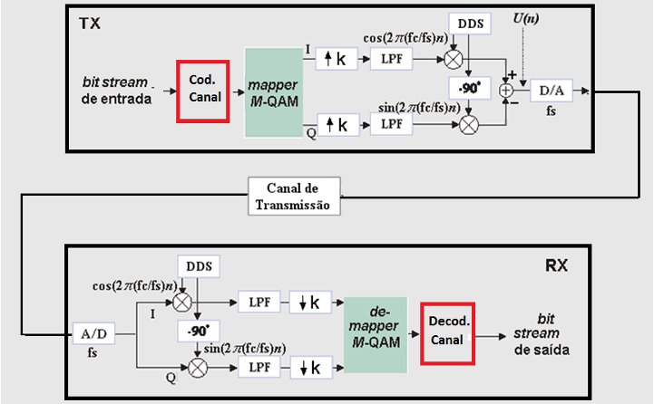

# Performance Evaluation of QPSK and 16-QAM Systems

MATLAB simulation developed for the *Digital Communication Systems Lab I* course.

## Objectives

- Evaluate the performance of QPSK and 16-QAM modulators/demodulators under an AWGN (Additive White Gaussian Noise) channel.
- Evaluate the impact of adding a block channel encoder/decoder on system performance.

## System Overview

The transmitter maps an input bitstream to QPSK/16-QAM symbols, applies pulse shaping with a Root-Raised Cosine (RRC) filter, and upconverts the signal to a carrier frequency via heterodyning. The signal is transmitted through a simulated AWGN channel. At the receiver, the signal is downconverted, matched-filtered, downsampled, and demapped back to bits.

In Part II, a block channel encoder/decoder is added before the mapper and after the demapper, respectively, to detect and correct transmission errors.

<p align="center">
  
</p>

## Methodology

1. Generated a random bitstream of at least 500,000 bits.
2. Modulated the bitstream using QPSK and 16-QAM.
3. Passed the modulated signal through an AWGN channel across a range of SNR values.
4. Computed the Bit Error Rate (BER) at each SNR by comparing transmitted and received bits.
5. Compared simulated BER curves against theoretical BER curves (`berawgn`).
6. Repeated the process with a block channel encoder/decoder to evaluate error correction gains.
7. Analyzed the received signal spectrum and IQ constellations at low, medium, and high SNR.

## Results

### BER vs. Eb/N0 — QPSK

<p align="center">
  
</p>

The simulated curve closely matches the theoretical BER curve for QPSK, confirming correct system implementation.

### BER vs. Eb/N0 — 16-QAM

<p align="center">
  
</p>

As expected, 16-QAM requires a higher Eb/N0 than QPSK to achieve the same BER, since it packs more bits per symbol and therefore has more (and closer) decision regions, making it more sensitive to noise.

### QPSK vs. 16-QAM

<p align="center">
  
</p>

For the same SNR, QPSK consistently achieves a lower BER than 16-QAM.

### Effect of Channel Coding

<p align="center">
  
</p>

Adding the block encoder/decoder significantly reduces BER for both modulations at a given SNR, since the code can correct single-bit and some double-bit error patterns. Interestingly, coded 16-QAM outperformed coded QPSK at the same SNR — highlighting the value of channel coding in compensating for a more noise-sensitive modulation.

### Constellations and Spectrum

At low SNR, constellation points are heavily dispersed and overlapping, leading to high symbol error probability. As SNR increases, clusters become tighter and clearly separated. The received signal spectrum shows that AWGN adds uniform noise power across all frequencies, including inside the signal's passband, degrading fidelity at low SNR while preserving the original spectral shape at high SNR.

## Repository Structure

```
experiment-07-ber-awgn-qpsk-16qam/
├── README.md
├── docs/
│   └── assignment.pdf
├── src/
│   ├── exp7_main.mlx
│   ├── encoder.m
│   ├── block_decoder.m
│   ├── qpsk_mapper.m
│   ├── qpsk_demapper.m
│   ├── qam16_mapper.m
│   └── qam16_demapper.m
└── results/
    ├── ber_qpsk.png
    ├── ber_16qam.png
    ├── ber_comparison.png
    ├── ber_coded_comparison.png
    └── ...
```

## Tools

- MATLAB (Communications Toolbox: `awgn`, `berawgn`, `rcosdesign`)

## References

1. HAYKIN, S., MOHER, M. *Sistemas de Comunicação*, 5th Ed. Porto Alegre: Bookman, 2011.
2. PROAKIS, J. G., SALEHI, M. *Communication Systems Engineering*, 2nd Ed. New Jersey: Prentice Hall, 2002.
